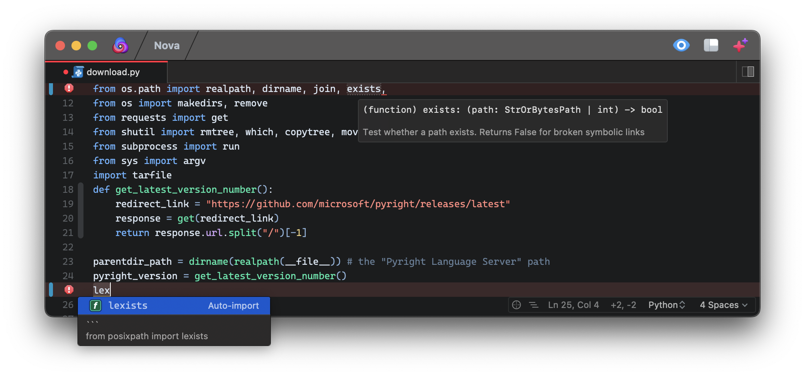

*Pyright for Nova* aids in Python development. It provides more useful code completions, automatically introduces import statements, and displays details about variables over which the cursor hovers.

## Features

* Automatically adds import statements after certain completions are accepted

* Alerts of unused variables, unused expressions, and references to undefined variables

* Information about a function's parameters is provided while its arguments are being filled in

## Installation

The extension requires that Node.js is installed.
